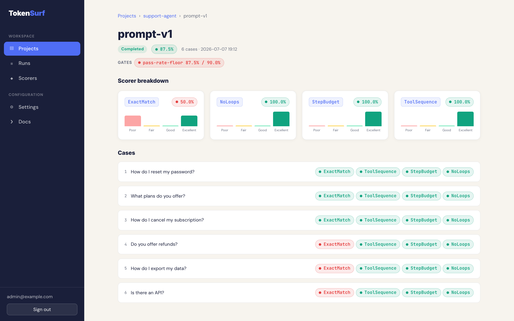

# Quality gates & notifications

Quality gates are per-project thresholds that TokenSurf Server evaluates against every run you
push to it. When a run breaches a gate (or errors), the server alerts your notification
channels — Slack, a generic webhook, or email. This page wires a Slack alert end to end and then
covers every knob along the way.



## End-to-end: Slack alert in four commands

```bash
# 1. A project and an ingest key (skip if you already have them)
uv run tokensurf-server create-project "My Agent"        # prints id=... slug=my-agent
uv run tokensurf-server create-key my-agent --label ci   # prints the raw key ONCE

# 2. A gate: fail any run whose overall pass rate drops below 90% (comparison defaults to gte)
uv run tokensurf-server create-gate my-agent pass-rate-floor pass_rate 0.9

# 3. A Slack channel: the secret is your Slack incoming-webhook URL
uv run tokensurf-server create-channel my-agent team-alerts \
  "https://hooks.slack.com/services/T000/B000/XXXX" --type slack

# 4. Push a run from CI; gates evaluate automatically on ingest
tokensurf eval run eval.py --server https://tokensurf.internal --key tsk_your_key --label "main@a1b2c3"
```

If the run's pass rate is, say, 0.75, the gate fails and Slack receives:

```text
TokenSurf | run 3f2a9c... | label=main@a1b2c3 | pass_rate=0.75 | Failed gates: pass-rate-floor
```

Prerequisite: `TOKENSURF_SECRET_KEY` must be set before you create channels — the channel secret
is encrypted at rest with a Fernet key derived from it (SHA-256 of the passphrase). If it is
missing, encryption raises at channel-creation time, not at server startup.

## How gates work

A gate is a rule of the form *metric comparison threshold*, e.g. `pass_rate gte 0.9`. On every
`POST /api/v1/runs`, the server loads the project's enabled gates, computes each metric from the
ingested report, and compares:

- The gate **passes** when `actual <comparison> threshold` holds (e.g. `0.95 gte 0.9`).
- Disabled gates are silently skipped.
- Gate evaluation is **best-effort and never blocks ingest**: the run is committed and the `201`
  returned regardless. If gate evaluation itself fails unexpectedly, the error is logged and the
  response carries an empty `gate_results` list; individual notification-delivery failures are
  swallowed per channel and do not affect `gate_results`.

Each evaluation is persisted as a `run_gate_results` row, so the dashboard can render historical
gate outcomes even for gates you later edit or delete.

### Metrics

| Metric             | Computed as                                        | Notes                                    |
|--------------------|----------------------------------------------------|------------------------------------------|
| `pass_rate`        | Fraction of non-errored scores with `passed=True`  | Across all scorers in the run            |
| `mean_score`       | Mean of numeric score values                       | Scores are normalized 0–1                |
| `scorer_pass_rate` | Pass rate restricted to one scorer                 | Set `--scorer` to the scorer's name      |

For `scorer_pass_rate`, the scorer name must match the registered scorer name exactly
(`ExactMatch`, `LLMJudge`, `ToolSequence`, ...) — see [Scorers](scorers.md). If you omit the
scorer, the metric falls back to the overall pass rate, same as `pass_rate`.

Thresholds are on the 0–1 scale (the Settings form constrains the input to 0–1; the CLI accepts
any float).

### Comparisons

| Comparison | Gate passes when       |
|------------|------------------------|
| `gte`      | `actual >= threshold`  |
| `gt`       | `actual > threshold`   |
| `lte`      | `actual <= threshold`  |
| `lt`       | `actual < threshold`   |

The default is `gte` — natural for "quality must stay at or above X". Use `lt`/`lte` for metrics
where lower is better.

### When the metric is None

If the metric cannot be computed — for example `mean_score` over a run where every score
errored — the actual value is `None` and the gate **passes**. There is no data to evaluate
against, so the server does not alert. The persisted gate result records `actual=None`.

## Creating gates

### Settings UI

Open `/settings/{slug}` in the dashboard. The **Quality Gates** card lists existing gates
(name, metric, scorer, rule, threshold, enabled) with a Delete action, and an **Add Gate** form
with the same fields except Enabled. Gates are created enabled.

### Admin CLI

```bash
uv run tokensurf-server create-gate <PROJECT_SLUG> <NAME> <METRIC> <THRESHOLD> \
  [--comparison lt|lte|gt|gte] [--scorer SCORER_NAME]
```

| Argument / option | Meaning                                                       |
|-------------------|---------------------------------------------------------------|
| `PROJECT_SLUG`    | Project the gate belongs to (exits 1 if not found)            |
| `NAME`            | Human-readable gate name (appears in chips and alerts)        |
| `METRIC`          | `pass_rate`, `mean_score`, or `scorer_pass_rate`              |
| `THRESHOLD`       | Float on the 0–1 scale                                        |
| `--comparison`    | `lt`, `lte`, `gt`, `gte` (default `gte`)                      |
| `--scorer`        | Scorer name; effectively required for `scorer_pass_rate` (see [Metrics](#metrics)) |

The command prints the new gate's id. A scorer-specific example:

```bash
uv run tokensurf-server create-gate my-agent judge-floor scorer_pass_rate 0.8 --scorer LLMJudge
```

## Where gate results show up

**Ingest API response.** `POST /api/v1/runs` returns `201` with a `RunSummary` whose
`gate_results` field carries one entry per evaluated gate:

```json
{
  "run_id": "3f2a9c...",
  "project": "my-agent",
  "status": "completed",
  "n_cases": 12,
  "pass_rate": 0.75,
  "mean_score": 0.81,
  "error_count": 0,
  "created_at": "2026-07-01T12:00:00Z",
  "gate_results": [
    {
      "name": "pass-rate-floor",
      "metric": "pass_rate",
      "passed": false,
      "actual": 0.75,
      "threshold": 0.9
    }
  ]
}
```

`gate_results` is populated only on the ingest response; `GET /api/v1/runs/{run_id}` returns the
same summary with an empty `gate_results` list. The persisted rows in `run_gate_results` are what
the dashboard renders.

**Run detail page.** Each evaluated gate renders as a chip: green with the gate name and actual
value when it passed, red with `name actual% / threshold%` when it failed.

**Runs list.** `/runs` shows a gate column per run (`passed`, `N failed`, or a dash when no gates
were evaluated) and a filter dropdown backed by the `gate` query parameter:
`/runs?gate=failed` or `/runs?gate=passed`.

## Notification channels

When at least one gate fails, or the run's status is `errored` (any score errored), the server
fires every enabled channel for the project.

### Channel types

| Type      | Secret field holds        | Delivery                                                       |
|-----------|---------------------------|----------------------------------------------------------------|
| `slack`   | Slack incoming-webhook URL| `POST {"text": message}` to the URL (5 s timeout)              |
| `webhook` | Any webhook URL           | `POST` JSON payload to the URL (5 s timeout)                   |
| `email`   | Not used for delivery     | SMTP send to the channel's **To** address via `TOKENSURF_SMTP_*` |

Channel secrets are encrypted at rest (Fernet, derived from `TOKENSURF_SECRET_KEY`) and the
Settings UI only ever shows a masked "set" indicator, never the value.

For `slack` and `webhook`, the secret **is** the webhook URL — treat it like a credential. For
`email`, delivery uses the server's SMTP configuration plus the channel's recipient address (the
`TO` argument in the CLI, the "To" field in the UI, stored as `config.to`); the channel needs a
`to` address or sends fail.

### SMTP configuration (email channels only)

| Env var                  | Default | Purpose                                            |
|--------------------------|---------|----------------------------------------------------|
| `TOKENSURF_SMTP_HOST`    | unset   | SMTP host; required to send email notifications    |
| `TOKENSURF_SMTP_PORT`    | `587`   | SMTP port                                          |
| `TOKENSURF_SMTP_USER`    | unset   | SMTP username (login only attempted if user+password set) |
| `TOKENSURF_SMTP_PASSWORD`| unset   | SMTP password                                      |
| `TOKENSURF_SMTP_FROM`    | unset   | From address; falls back to the SMTP user, then `tokensurf@localhost` |

### Creating channels

Settings UI: the **Notification Channels** card on `/settings/{slug}` has an **Add Channel** form
(name, type, secret / webhook URL, To for email) plus per-channel **Test** and **Delete** actions.

Admin CLI:

```bash
uv run tokensurf-server create-channel <PROJECT_SLUG> <NAME> <SECRET> [TO] --type slack|webhook|email
```

`TO` is the positional recipient address, used by the `email` type. The command prints the new
channel's id.

### What a message contains

Slack and email use the same human-readable summary, built from the run id, optional label, pass
rate (two decimals), and the names of any failed gates:

```text
TokenSurf | run 3f2a9c... | label=main@a1b2c3 | pass_rate=0.75 | Failed gates: pass-rate-floor
```

When the alert is triggered by an errored run with no gate failures, the "Failed gates" segment
is omitted. Email uses the subject `TokenSurf alert: run <run_id>` with that summary as the body.

The generic webhook receives structured JSON instead:

```json
{
  "project": "<project_id>",
  "run_id": "3f2a9c...",
  "label": "main@a1b2c3",
  "pass_rate": 0.75,
  "failed_gates": ["pass-rate-floor"]
}
```

### Test-send

Each channel row in Settings has a **Test** button (`POST /settings/{slug}/channels/{id}/test`).
It fires a synthetic notification through the real notifier — run id `test-send`, label
`Test notification`, pass rate `1.00`, no failed gates — so you can verify the webhook URL or SMTP
setup before a real breach. Use it right after step 3 of the Slack example above; you should see
`TokenSurf | run test-send | label=Test notification | pass_rate=1.00` in your Slack channel.

Test-send is best-effort and never returns a 500; on failure it logs a warning to the server log
containing only the exception class name, then redirects back to Settings.

### Delivery is best-effort and logged

Notifications never affect ingest: a channel failure is swallowed, and the next channel still
fires. Every real-run delivery attempt writes a row to the `notification_logs` table:

| Column       | Contents                                          |
|--------------|---------------------------------------------------|
| `channel_id` | The channel that was fired                        |
| `run_id`     | The run that triggered the alert                  |
| `ok`         | Whether the send succeeded                        |
| `error`      | On failure, the exception **class name only**     |
| `created_at` | Timestamp                                         |

The `error` column deliberately stores only the exception class name (e.g. `HTTPStatusError`),
never the exception message: for Slack and webhook channels the decrypted secret is the URL, and
HTTP client errors embed the full URL in their message. Storing the class name keeps the secret
out of both the database and the application log.
